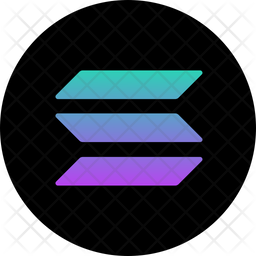

# Trading-Project

**Proyecto de Automatización de Estrategias de Inversión con IA, Ciencia de Datos y Machine Learning**

## ¿Qué es este proyecto?
Este repositorio documenta y centraliza el desarrollo de un sistema avanzado para automatizar estrategias de inversión en criptomonedas, acciones, bonos y otros activos financieros. El objetivo principal es maximizar el rendimiento y minimizar el riesgo utilizando herramientas de Inteligencia Artificial, Ciencia de Datos y Machine Learning.

Nuestro enfoque inicial está en las criptomonedas, especialmente en Avalanche (AVAX), Solana (SOL) y Polygon (MATIC), mientras construimos un marco escalable para incluir otros mercados financieros.

  
  
  

---

## ¿Por qué es importante?
El mercado financiero presenta una complejidad creciente debido al gran volumen de datos, la alta volatilidad y la velocidad de los movimientos. Este proyecto busca:

1. **Automatizar Decisiones**: Diseñar un bot que pueda analizar datos y ejecutar operaciones automáticamente en tiempo real.
2. **Reducir el Riesgo**: Implementar algoritmos que optimicen las decisiones de compra y venta, basados en análisis cuantitativos y modelos predictivos.
3. **Aumentar el Rendimiento**: Utilizar Machine Learning para identificar patrones ocultos en los datos y capitalizar oportunidades de inversión.
4. **Escalabilidad**: Crear un sistema adaptable que pueda analizar diversos mercados y activos.

---

## Tecnologías y Herramientas
Este proyecto utiliza una combinación de herramientas y tecnologías avanzadas:

- **Lenguaje de Programación**: Python
- **Librerías de Ciencia de Datos**: pandas, numpy, matplotlib, scikit-learn
- **Análisis Técnico**: Indicadores como RSI, Bollinger Bands, medias móviles, y niveles de soporte/resistencia.
- **Machine Learning**: Modelos predictivos para la detección de tendencias.
- **APIs de Exchanges**:
  - Binance
  - KuCoin
- **Automatización en Hardware**: NVIDIA Jetson Nano para un entorno de ejecución optimizado.
- **VPN**: ProtonVPN para evitar restricciones geográficas de las API.

  
  
  
  

---

## Estructura del Repositorio

/docs               # Documentación del proyecto 
/scripts            # Códigos Python para trading 
&nbsp;&nbsp;&nbsp;&nbsp;&nbsp;/binance        # Scripts específicos para Binance 
&nbsp;&nbsp;&nbsp;&nbsp;&nbsp;/kucoin         # Scripts específicos para KuCoin 
&nbsp;&nbsp;&nbsp;&nbsp;&nbsp;/indicators     # Algoritmos de cálculo de indicadores técnicos 
/models             # Modelos de Machine Learning 
/tests              # Scripts de prueba y validación 
/results            # Resultados y gráficas de ganancias 
/requirements.txt   # Lista de dependencias 
README.md           # Descripción general del proyecto 

---

## Capital de Inversión
El capital inicial de inversión para este proyecto será de **10,000 MXN** (aproximadamente **500 USD**), distribuido entre las estrategias desarrolladas para criptomonedas, acciones y bonos.

---

## Objetivos
1. **Desarrollar un Bot de Trading**: Crear un sistema que pueda operar automáticamente en tiempo real en diferentes mercados financieros.
2. **Integrar Machine Learning**: Aplicar modelos para predicción de tendencias y optimización de decisiones.
3. **Analizar Riesgos**: Diseñar estrategias que minimicen la exposición a mercados volátiles.
4. **Documentar el Proceso**: Compartir avances, retos y logros en plataformas como TikTok.

---

## Cómo Contribuir
¡Estás invitado a participar en este proyecto! Si tienes ideas, sugerencias o mejoras, sigue estos pasos:

1. Haz un fork del repositorio.
2. Crea una nueva rama para tus cambios: [git checkout -b feature nueva-funcionalidad]
3. Realiza un pull request describiendo tus cambios.

---

## Autor
Este proyecto está desarrollado por [**Antonio Richaud**](https://Antonio-Richaud.com) y documentado en TikTok como parte de una iniciativa para combinar tecnología avanzada con trading.

<a href="https://www.tiktok.com/@antonio_richaud/playlist" style="display:inline-block; padding:10px 20px; background-color:#7501e9; color:white; text-decoration:none; font-weight:bold; border-radius:5px;">Ver lista de reproducción en TikTok</a>

### Conecta conmigo:

